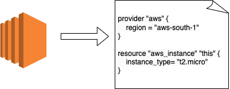

# tfconfigbuilder

tfconfigbuilder is a Proof of Concept command-line tool that parses and converts an infrastructure diagram drawn in [draw.io](https://www.drawio.com/) and exported as an xml file into a terraform configuration file. Support is only for infrastructure mappings targeted at AWS resources. 



> Note, this project is WIP and still experimental. No guarantees are provided.

## Getting Started
These instructions will get you a copy of the project on your local machine for development and testing purposes.
Before you begin, ensure you have the following installed:

* Go (~ 1.20)
* Terraform 

### Installing 
To get stated with `tfconfigbuilder`:

```bash
git clone https://github.com/tatomoaki/tfconfigbuilder.git
cd tfconfigbuilder
go build -o tfconfigbuilder
```


### Usage 
To generate a HCL file using `tfconfigbuilder`:

1. Draw your AWS infrastructure in [draw.io](https://www.drawio.com/).
2. Export file as an uncompressed XML File. (File -> Export as -> XML -> Export -> Save to filesystem)
3. Run `tfconfigbuilder` tool with command below.

```bash
./tfconfigbuilder gen --file path/to/your/draw.io.xml
```

Assuming you have an XML file with this content below: 
```xml
<?xml version="1.0" encoding="UTF-8"?>
<mxfile host="app.diagrams.net" type="google">
  <diagram name="Page-1" id="sYZNLJ5LxPdhcUlApB4R">
    <mxGraphModel dx="1434" dy="711" grid="1" gridSize="10" guides="1" tooltips="1" connect="1" arrows="1" fold="1" page="1" pageScale="1" pageWidth="827" pageHeight="1169" math="0" shadow="0">
      <root>
        <mxCell id="0" />
        <mxCell id="1" parent="0" />
        <mxCell id="LDINxFX0i1uucx2FuAdr-1" value="" style="outlineConnect=0;dashed=0;verticalLabelPosition=bottom;verticalAlign=top;align=center;html=1;shape=mxgraph.aws3.ec2;fillColor=#F58534;gradientColor=none;" vertex="1" parent="1">
          <mxGeometry x="150" y="240" width="76.5" height="93" as="geometry" />
        </mxCell>
      </root>
    </mxGraphModel>
  </diagram>
</mxfile>
```
`tfconfigbuilder` will convert above XML content into this Terraform configuration file

```terraform
terraform {
  required_providers {
    aws = {
      source  = "hashicorp/aws"
      version = "~> 5.0"
    }
  }
}

provider "aws" {
  region = "af-south-1"
}

resource "aws_instance" "this" {
  instance_type = "t2.micro"
}
```

### Testing
To run tests, use the following command
```bash
go test ./... -coverage=coverage.out
```
This will generate a coverage report, which can be viewed by running

```bash
go tool cover -html=coverage.out
```
